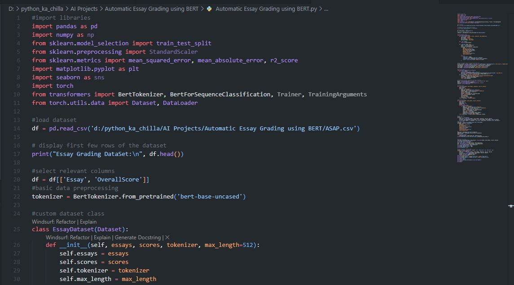
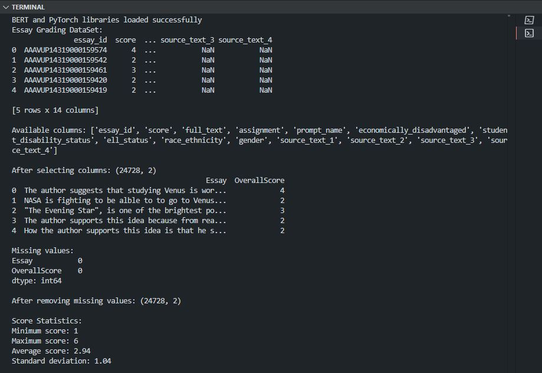
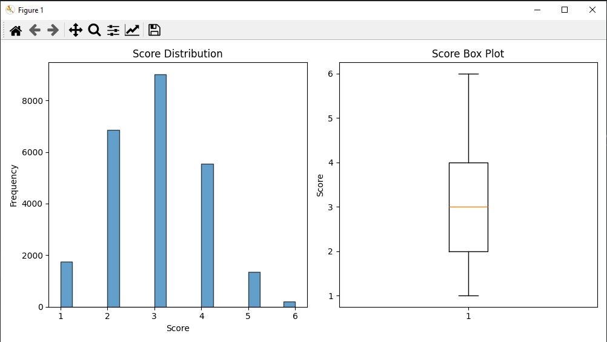

# 🧠 Automatic Essay Grader | AI-Powered Scoring System 🤖  
        

<p align="center">
  
</p>

🚀 The **Automatic Essay Grader** is an advanced AI system that automatically scores essays using state-of-the-art Natural Language Processing. It combines the power of **BERT** with traditional machine learning approaches to provide accurate, consistent, and scalable essay grading. Perfect for educators, researchers, and automated assessment platforms.

---

## ✨ Key Features  
🤖 **BERT Integration** – Leverages pre-trained BERT models for deep semantic understanding  
📊 **TF-IDF Fallback** – Traditional ML approach (Random Forest, Linear Regression) when BERT is unavailable  
📈 **Comprehensive Metrics** – Reports MSE, MAE, R², and detailed statistical analysis  
🎨 **Visual Analytics** – Generates interactive plots and score distribution graphs  
🔄 **Auto Fallback** – Seamlessly switches between BERT and traditional methods  
📝 **Essay Analysis** – Computes word count, sentence structure, lexical diversity  

---

## 🧠 Tech Stack  
- **Language:** Python 🐍  
- **Deep Learning:** PyTorch, HuggingFace Transformers (BERT) 🤗  
- **ML Libraries:** scikit-learn, pandas, NumPy  
- **Visualization:** Matplotlib, Seaborn  
- **Recommended IDE:** VS Code / PyCharm 💻  

---

## 📦 Installation  

```bash
git clone https://github.com/SayabArshad/Automatic-Essay-Grader.git
cd Automatic-Essay-Grader
pip install -r requirements.txt
````

⚙️ Note: Ensure you have Python 3.8+ and PyTorch installed (CUDA optional but recommended for BERT).

---

##  ▶️ Usage

```bash
python "Automatic Essay Grading using BERT.py"
```

The script will load the dataset (ASAP.csv), preprocess essays, train/evaluate models, and display performance metrics along with visualizations.

---

## 📁 Project Structure

```
Automatic-Essay-Grader/
│-- Automatic Essay Grading using BERT.py  
│-- ASAP.csv                                 
│-- requirements.txt                         
│-- README.md                                 
│-- assets/                                   
│    ├── code.JPG
│    ├── output.JPG
│    └── plot.JPG
```

---

## 🖼️ Interface Previews

| 📝 Code Snippet | 📊 Console Output |
|:---------------:|:-----------------:|
|  |  |

## 📈 Visualizations



---

## 💡 About the Project

This project demonstrates the application of BERT-based language models for automated essay scoring. It builds a robust pipeline that preprocesses text, extracts features using either BERT embeddings or TF-IDF, and trains regression models to predict essay scores. The dual‑model architecture ensures reliability even in resource‑constrained environments. Ideal for understanding NLP in real‑world educational technology.

---

## 🧑‍💻 Author

**Developed by:** [Sayab Arshad Soduzai](https://github.com/SayabArshad) 👨‍💻

📅 **Version:** 1.0.0

📜 **License:** MIT License


---

## ⭐ Contributions

Contributions are welcome! Fork the repository, open issues, or submit pull requests to improve the tool (e.g., adding more models, integrating with LMS, or supporting larger datasets).
If you find this project useful, don’t forget to ⭐ star the repository to show your support.

---

## 📧 Contact

For queries, collaborations, or feedback, reach out at **[sayabarshad789@gmail.com](mailto:sayabarshad789@gmail.com)**


---

📝 Empowering educators with AI-driven essay evaluation.
